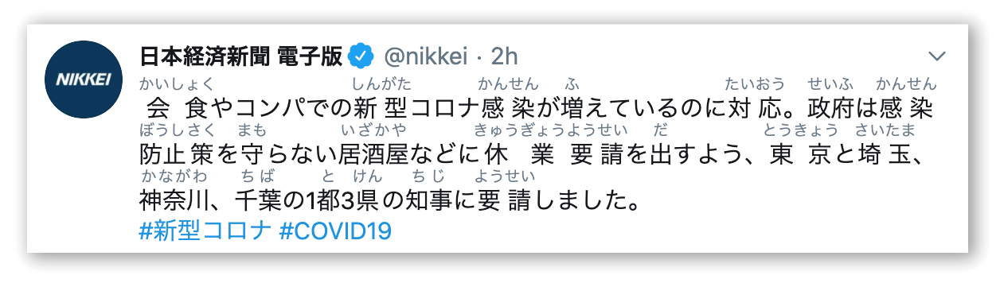

# mirigana-everywhere
an experimental chrome extension to insert furigana for any website.



## Installation

```
# prerequisite, for the watch and pack scripts
brew install fswatch jq
```

```
# build the background.js(service worker), both for dev and prod
./watch

# pack the extension
./pack
```

### Windows
For Windows use WSL and install or build fswatch and jquery.

## Credits

mirigana-everywhere is based on [mirigana](https://github.com/mirigana/mirigana).

It relies on the following projects:

- **kuromoji.js** *https://github.com/takuyaa/kuromoji.js*
- **mecab-ipadic** *https://sourceforge.net/projects/mecab/*
- **mecab-ipadic-NEologd** *https://github.com/neologd/mecab-ipadic-neologd*
- **html-element-picker.js** *https://github.com/AlienKevin/html-element-picker*
